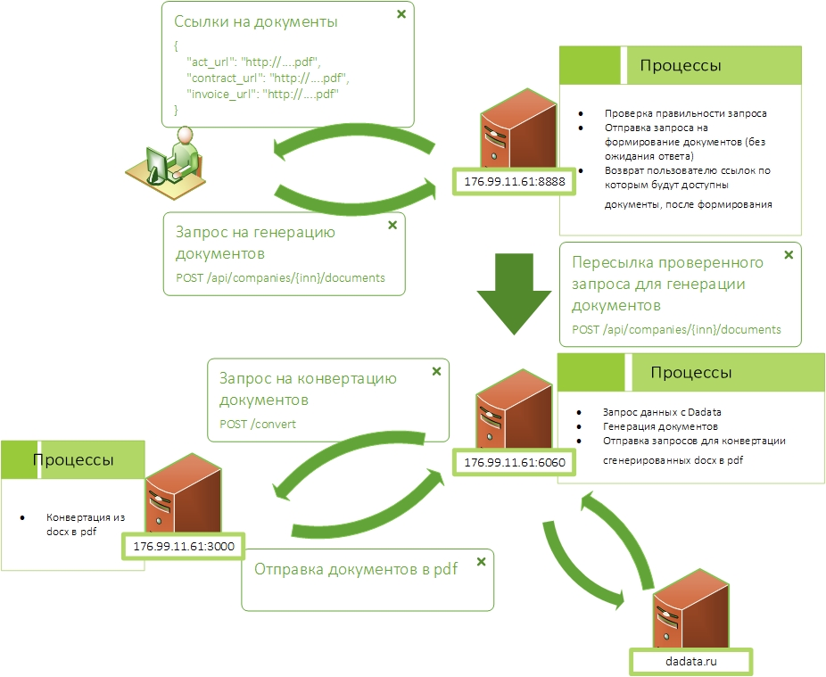

# Веб-сервис для получения юридической информации об организации по ИНН

[Данные о компании по ИНН](./Untitled-364bc594-bf55-438b-8062-50688ac68775.md)

[Автоматизированное формирование учетных документов](./Untitled-843a3f50-d07c-4dbe-8726-d244bcf6dd54.md)

[https://github.com/guleroman/innApi](https://github.com/guleroman/innApi)

Сервис по формированию данных компании и документов по API. Никакого UI. 

- Получение по API ИНН
- Формирование данных компании по ИНН
- Отдача данных компании
- Формирование Документов
- Отдача ссылок на документы

## Deployment with Dockerfile:

### 1.1 Download the full repository located on this page

    D:\> git clone https://github.com/guleroman/innApi.git

### 1.2 Build..

    D:\> cd innApi
    D:\innApi> docker build -t innapi .
    D:\innApi> docker build -t innapi_2 ./responser

### 1.3 ..then Run

    D:\innApi> docker run --name innapi_2 -p 8888:5000 -d innapi_2
    D:\innApi> docker run --name innapi -p 6060:6060 -d innapi

